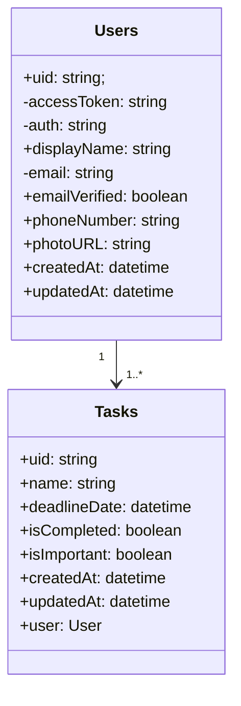

# To DO App System Design
## System requirements

### Functional:
1. User Management: User registration and login, Allow user to update their password.
2. Task Management: Allow users to add, update, and delete tasks.
3. Prioritization: Mark a task as important if the task is a higher priority.
4. Complete: Mark a task as completed if the task is completed.

### Non-Functional:
1. **Scalability:** Handle thousands of concurrent users.
2. **Reliability:** Ensure high availability, with accurate and consistent data logging.
3. **Performance:** Minimal latency for all CRUD operations related to time tracking.
4. **Security and Privacy:** Protect user data and ensure secure authentication.
5. **Usability:** Provide an intuitive user experience across web and mobile applications.

## Capacity estimation

1. User Base: Assume an initial user base of 25 with a growth of 1000.
2. Tasks per User: Assume each user will create 5 tasks on average.
- Total tasks = 1000 users * 5 tasks = 5000 tasks.
3. Storage Requirements:
- Average task data size (with metadata): ~1 KB.
- Storage needed for tasks = 5000 * 1 KB = 5 MB.
4. Read/Write Operations:
- Heavy read operations as users frequently retrieve tasks.
- Moderate write operations for creating and updating tasks.

## API design
1. User API
- `GET /users`: Fetch all users.
- `GET /users/{user_id}`: Fetch a user by id.
- `PUT /users/{user_id}`: Update a user by id.
- `DELETE /users/{user_id}`: Delete a user by id.
2. Authentication API
- `POST /signup`: Sign up a user.
-  `POST /login`: Log a user.
3. Todo API
- `POST /tasks`: Create a new task.
- `GET /tasks`: Fetch all Tasks.
- `GET /tasks/{task_id}`: Fetch a task by id.
- `PUT /tasks/{task_id}`: Update a task by id.
- `DELETE /tasks/{task_id}`: Delete a task by id.

## ER Diagram

### High-Level Design (MicroService)
note: This high-level design will be implemented later when the user increases to 1 million users.
#### Architecture Components:
1. Frontend:
- Web and mobile applications allowing users to interact with the to-do list.
- Responsive UI supporting task management and collaboration.
2. Backend Services:
User Management Service: Handles registration, login, and user profiles.
Task Management Service: Manages CRUD operations on tasks, status updates, and reminders.
Notification Service: Sends notifications and reminders based on task due dates or custom reminders.
Collaboration Service: Enables task sharing and assignment between users.

3.Data Store:
- Relational Database (e.g., PostgreSQL or MySQL) to manage structured data on users, tasks, and reminders.
- Caching Layer:
Redis or Memcached to cache frequently accessed data such as task lists to improve performance.
4. Message Queue (for Notifications):
- A queue system (e.g., RabbitMQ or Amazon SQS) to handle reminder notifications.
